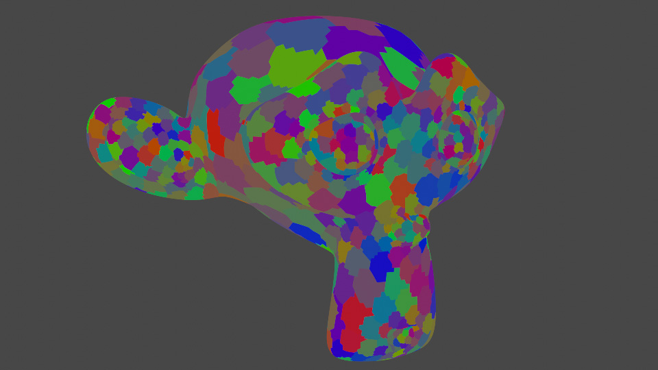
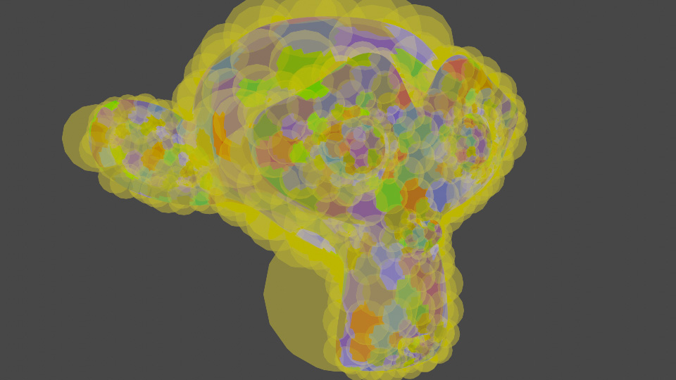
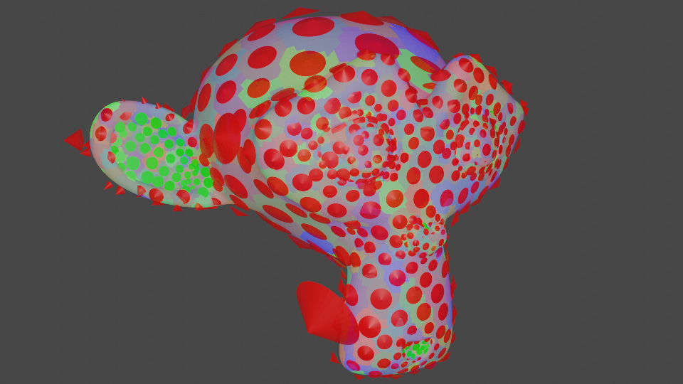

# Meshlete

*Chop 3D objects to meshlets*

Meshlete is a Windows command line tool which converts 3D models to meshlet-based 3D models. I developed the tool originally for my tiled software rasterizer and Arduino graphics library ([video]( https://www.youtube.com/watch?v=Xs_5Sv9oBtk)) hobby project, but it can be useful for other applications as well, e.g. DX12-based modern renderers using mesh shaders.

Meshlets are small chunks of 3D geometry consisting some small number of vertices and triangles. Below is an image of a 3D model from Blender called “Suzanne” which is split to meshlets of max 64 vertices in each (**-mv 64**) and visualized with different colors. Splitting the geometry processing to meshlets instead of processing the mesh as a whole has various benefits and has better fit with batch-based geometry processing (vs post-transform cache model) in modern GPU architectures as well.

<p align="center">
  
</p>

The tool outputs the generated data in *p3g* file format that was developed to be Arduino-friendly and to enable rendering 3D models straight from read-only memory without need for run-time data processing. The format is quite straight forward and documented in **doc/file_format_p3g.xlsx** if you want to parse it. The tool also supports debug output to Collada (dae) file format to visualize the generated meshlets e.g. in [Blender](https://www.blender.org). The input 3D model can be in *dae*, *obj*, *fbx*, *lwo* or *3ds* file formats, but be aware that the format parsing can be a bit flaky so try different format if you have problems with one.

For the generated *p3g* file the tool supports custom vertex formats, which are defined in **bin/vfmt.xml** file, so you can define for example multiple UV’s, color channels, custom data layout and packing using expressions. There are some predefined formats in the file, but you can add more or define your own vertex format config file (use with **-vc** argument). When running the tool the used vertex format is defined with **-vf** argument followed by the name of the format in the config.

An example to split the Suzanne model to meshlets with bounding spheres and visibility cones and 10 bytes/vertex format (packed position+normal):
```
./meshlete -i ../test_data/suzanne.dae -o suzanne.p3g -vf pack_pn -mb -mc
```
Or to output debug 3D object to view in Blender with bounding spheres and visibility cones:
```
./meshlete -i ../test_data/suzanne.dae -do suzanne_debug.dae -vf pack_pn -db -dc
```

# Meshlet Bounding Spheres and Visibility Cones
The tool can calculate bounding spheres (**-mb** and **-db** options) and visibility cones (**-mc** and **-dc** options) for the generated meshlets to help cull away geometry that doesn’t contribute to the final image for given camera view at run-time. The meshlet culling is more fine grained than classic object-level culling and can be done cheaply prior to any meshlet vertex processing thus improving the rendering performance. The storage requirements in *p3g* file for this culling data are quite small: 32 bits / meshlet for the bounding spheres and 32 bits / meshlet for the cones.

For example if the meshlet bounding sphere is outside given camera FOV, the meshlet geometry processing can be entirely skipped. The spheres can be also used for occlusion culling, i.e. if the sphere is further than previously rasterized depth values, the meshlet processing can be skipped. In my tiled software rasterizer the bounding spheres are tested against rasterized hi-z for fast occlusion culling ([video](http://www.youtube.com/watch?v=B-2ABFcQLz0)). Furthermore, I’m also using the screen extents of the spheres to classify meshlets to tiles so having tight meshlet bounds reduces vertex processing and triangle setup cost.

The image below shows the yellow bounding spheres of meshlets for the Suzanne 3D model. For the tool you can use command line option **-db** to output the bounding spheres to the debug mesh file defined with **-do**.

<p align="center">
  
</p>

Visibility cone culling is another cheap way to reduce run-time geometry processing of rigid geometry. The cone is stored for each meshlet, which defines a region in space where the meshlet is potentially visible. The check to cull the meshlet is very cheap operation of comparing dot product of cone and camera vectors against precalculated cone angle. A common method to calculate the visibility cone is by fitting a cone to meshlet triangle normals, but this enables meshlet culling only for regions where all meshlet triangles are back facing. The tool does also occlusion calculation for meshlets, which enables intra-object meshlet occlusion testing with visibility cones as well, e.g. meshlets in the inner parts of a cup can be conservatively culled due to the occlusion even if a meshlet has front facing triangles.

The image below visualizes the visibility cones for the Suzanne 3D model with the red and green cones. You can use command line option **-dc** to output visibility cones to the debug output file defined with **-do**. For the visualization red cones are used to show visibility reflex cone (i.e. region where the meshlet is invisible) when the cone apex angle is greater than 180 degree, and green cones the region where the meshlet is visible and the angle is  <=180  degrees. Note how in model concavities (ears, mouth) the cones are green because of the occlusion.

<p align="center">
  
</p>

